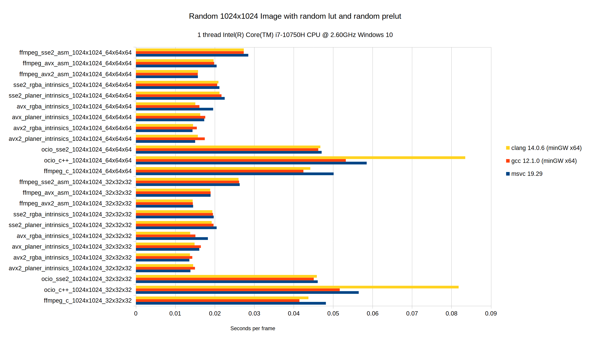
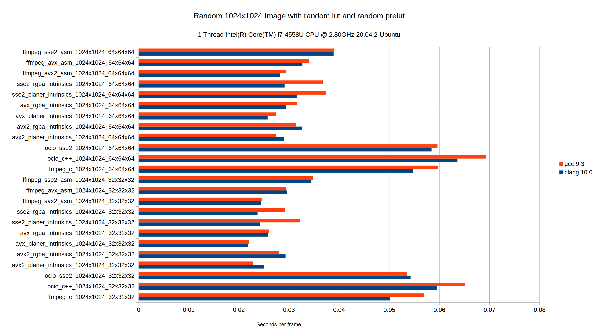
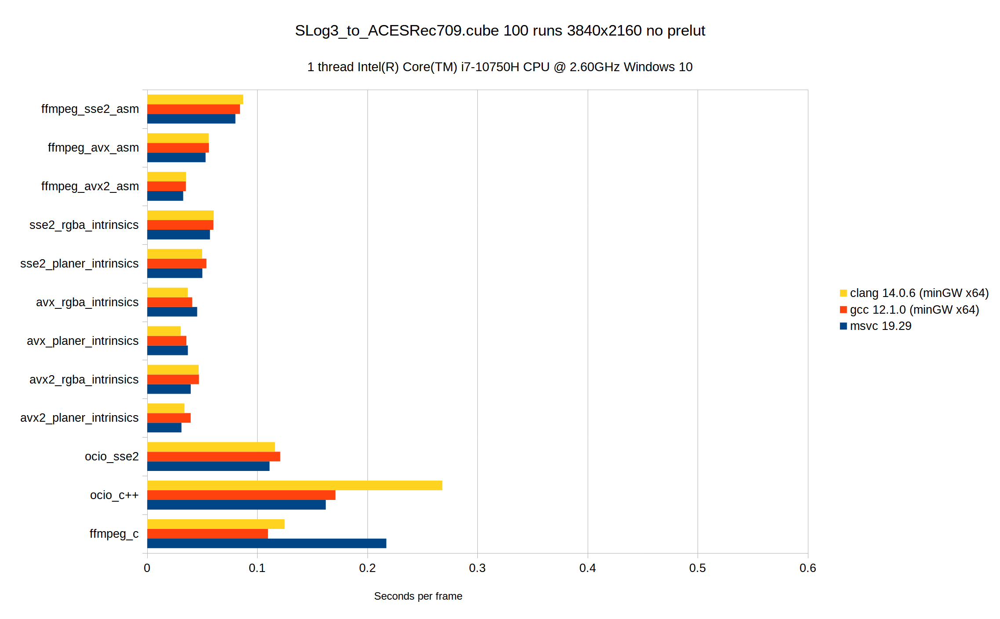

# Performance Tests For Various Tetrahedral 3D Lut Implementations

This is a small project to test performance between different
tetrahedral 3D Lut implementations and compilers.
I've only focused x86_64 and SSE2, AVX and AVX2 instruction sets for now.
It would be nice to have a ARM NEON implementation at some point.

## Test Implementations

- FFmpeg c
- OpenColorIO c++
- OpenColorIO SSE2
- AVX2 intrinsics
- AVX intrinsics
- SSE2 intrinsics
- FFmpeg AVX2 assembly
- FFmpeg AVX assembly
- FFmpeg SSE2 assembly

## Requirements
- cmake
- [yasm](https://yasm.tortall.net)
- msvc, gcc or clang

## Test Results






AVX intrinsic version can produce slower/similar speed code to SSE2 on some compilers when compared to the AVX assembly version.
Still investigating why.

## Testing


### Linux / macOS / MSYS2

From a terminal run

```bash
mkdir build
cd build
cmake ..
cmake --build .
ctest . -R test_rand -V
ctest . -R test_lut1 -V
ctest . -R test_lut2 -V
```

### Windows MSVC

From the **MSVC x64 native tools** command prompt run

NOTE: make sure yasm in your PATH

```cmd
mkdir build
cd build
cmake ..
cmake --build . --config Release
ctest . -R test_rand -C Release -V
ctest . -R test_lut1 -C Release -V
ctest . -R test_lut2 -C Release -V
```
